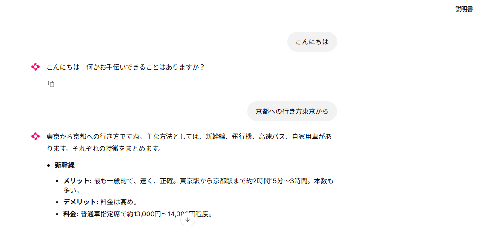

## Agnoとの連携

python ライブラリ追加
``` bash
pip install -U agno  
```

[サンプルコード参考サイト](https://docs.agno.com/cookbook/models/google)


.envファイル用意
GEMINI_API_KEYのままでもいいが、ワーニングがでるのでうざい場合はこちらのキー名で設定
値はGEMINI_API_KEYのものでOK
```
GOOGLE_API_KEY=*your_api_key*
```

```python
from agno.agent import Agent
from agno.models.google import Gemini
from dotenv import load_dotenv

load_dotenv()

# Using Google AI Studio
agent = Agent(
	model=Gemini(id="gemini-2.0-flash"),
	markdown=True,
)


# Print the response in the terminal
agent.print_response("発表時に緊張しないコツは？")

```

## チャットアプリの作成

python ライブラリ追加
``` bash
pip install chainlit
```

[サンプルコード参考サイト](https://github.com/tinztwins/finllm-apps/blob/main/chat-with-financial-charts/app.py)

[InMemoryDbについて](https://docs.agno.com/reference/storage/in_memory)

app.py
```python
import chainlit as cl
from agno.agent import Agent
from agno.models.google import Gemini
from agno.media import Image
from dotenv import load_dotenv
from agno.db.in_memory import InMemoryDb

load_dotenv()


@cl.on_chat_start
async def on_chat_start():

	agent = Agent(
		model=Gemini(id="gemini-2.0-flash"),
		description="あなたは、さまざまな分野で人々を支援する有能なAIエージェントです。",
		instructions=["内容をよく理解し、正確かつ丁寧に回答してください。"],
		db=InMemoryDb(),
		add_history_to_context=True,
	)

	cl.user_session.set("agent", agent)


@cl.on_message
async def on_message(message: cl.Message):

	images = [
		Image(filepath=file.path) for file in message.elements if "image" in file.mime
	]

	agent = cl.user_session.get("agent")

	msg = cl.Message(content="")
	async for chunk in agent.arun(
		message.content,  # ユーザーからの入力メッセージ（テキスト）
		images=images,  # 添付された画像（Imageオブジェクトのリスト）
		stream=True,  # モデルの応答をチャンク（分割）で受け取るかどうか
	):

		await msg.stream_token(getattr(chunk, "content", str(chunk)))

	await msg.send()


```

実行方法
``` bash
chainlit run app.py
```

成功すれば　http://localhost:8000　でチャットアプリが起動する

