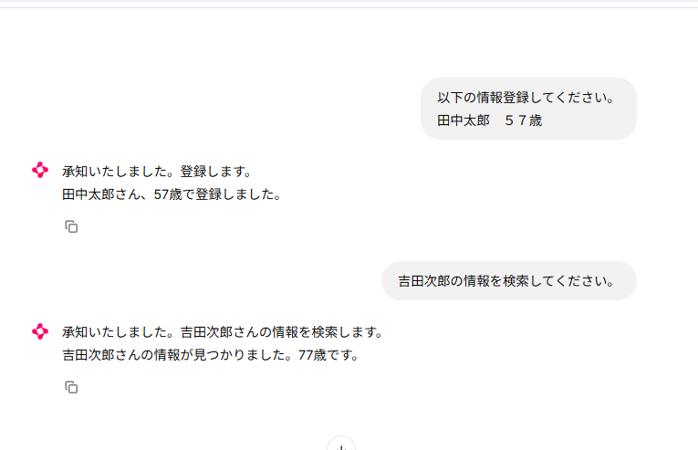
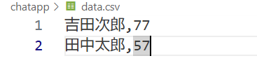
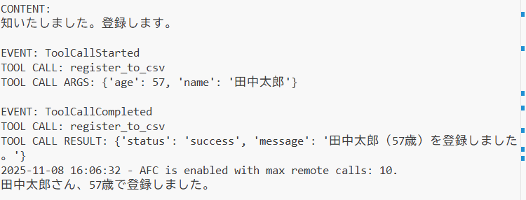
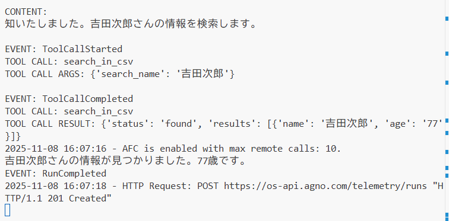

## 自作ツールをエージェントに使用させる

例として、csvファイルへの登録を行う関数と、ファイル内を検索する関数を用意
[@toolの使用方法](https://docs.agno.com/cookbook/tools/custom-tools)
``` python
import csv
from agno.tools import tool


# 定数としてファイル名を定義
FILENAME = "data.csv"


@tool(description="指定された名前と年齢をCSVファイルに登録します。")
def register_to_csv(name: str, age: int):
	try:
		with open(FILENAME, mode="a", newline="", encoding="utf-8") as file:
			writer = csv.writer(file)
			writer.writerow([name, age])
		return {"status": "success", "message": f"{name}（{age}歳）を登録しました。"}
	except Exception as e:
		return {"status": "error", "message": str(e)}


@tool(description="CSVファイルから指定された名前のユーザー情報を検索します。")
def search_in_csv(search_name: str):
	results = []
	try:
		with open(FILENAME, mode="r", encoding="utf-8") as file:
			reader = csv.reader(file)
			for row in reader:
				if row and row[0] == search_name:
					results.append({"name": row[0], "age": row[1]})
		if results:
			return {"status": "found", "results": results}
		else:
			return {
				"status": "not_found",
				"message": f"{search_name} は見つかりませんでした。",
			}
	except FileNotFoundError:
		return {"status": "error", "message": "CSVファイルが存在しません。"}
	except Exception as e:
		return {"status": "error", "message": str(e)}

```

AIエージェントのソース

[イベントについて](https://spacesail.mintlify.app/examples/concepts/agent/events/basic_agent_events)

``` python
import chainlit as cl
from agno.agent import Agent
from agno.models.google import Gemini
from agno.media import Image
from dotenv import load_dotenv
from agno.db.in_memory import InMemoryDb
from agno.agent import RunEvent
from csv_db import register_to_csv, search_in_csv

load_dotenv()


@cl.on_chat_start
async def on_chat_start():

	agent = Agent(
		model=Gemini(id="gemini-2.0-flash"),
		description="あなたは、さまざまな分野で人々を支援する有能なAIエージェントです。",
		instructions=[
			"内容をよく理解し、正確かつ丁寧に回答してください。",
			"ツールの呼び出しは、ユーザーの入力内容に応じて適切なタイミングで行ってください。",
		],
		db=InMemoryDb(),
		add_history_to_context=True,
		tools=[register_to_csv, search_in_csv],
	)

	cl.user_session.set("agent", agent)


@cl.on_message
async def on_message(message: cl.Message):
	content_started = False
	images = [
		Image(filepath=file.path) for file in message.elements if "image" in file.mime
	]

	agent = cl.user_session.get("agent")

	msg = cl.Message(content="")
	async for chunk in agent.arun(
		message.content,  # ユーザーからの入力メッセージ（テキスト）
		images=images,  # 添付された画像（Imageオブジェクトのリスト）
		stream=True,  # モデルの応答をチャンク（分割）で受け取るかどうか
		stream_events=True,  # ツール呼び出しなどのイベントもチャンクとして受け取るかどうか
	):
		if chunk.event in [RunEvent.run_started, RunEvent.run_completed]:
			print(f"\nEVENT: {chunk.event}")

		if chunk.event in [RunEvent.tool_call_started]:
			print(f"\nEVENT: {chunk.event}")
			print(f"TOOL CALL: {chunk.tool.tool_name}")
			print(f"TOOL CALL ARGS: {chunk.tool.tool_args}")

		if chunk.event in [RunEvent.tool_call_completed]:
			print(f"\nEVENT: {chunk.event}")
			print(f"TOOL CALL: {chunk.tool.tool_name}")
			print(f"TOOL CALL RESULT: {chunk.tool.result}")

		if chunk.event in [RunEvent.run_content]:
			if not content_started:
				print("\nCONTENT:")
				content_started = True
			else:
				print(chunk.content, end="")

			await msg.stream_token(getattr(chunk, "content", str(chunk)))

	await msg.send()

```
await msg.stream_token(getattr(chunk, "content", str(chunk))) の処理が　チャットに返すメッセージを格納している処理
tool_call_startedの分岐でも実行すれば　読んでいるtoolをチャットに表示することもできる
（ツールの実行時間が長いなら、呼んでいるツールと、実行中ですというメッセージを出してあげるのも親切設計かもしれません）

実行例

csvファイルの中身


コンソール出力内容
呼び出している関数名と引数が表示されているのが分かる


