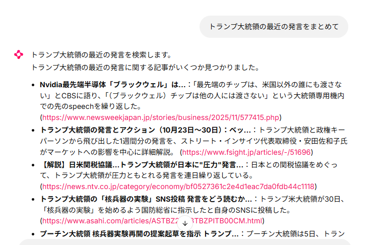
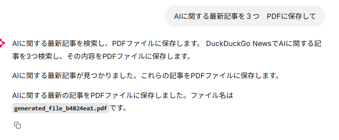
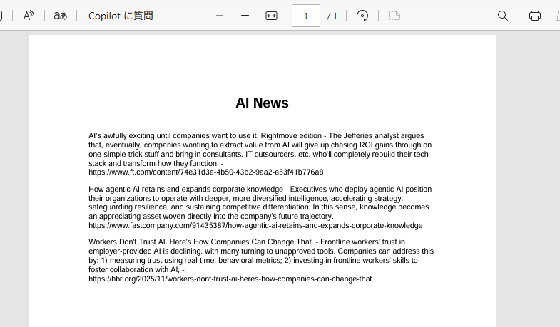
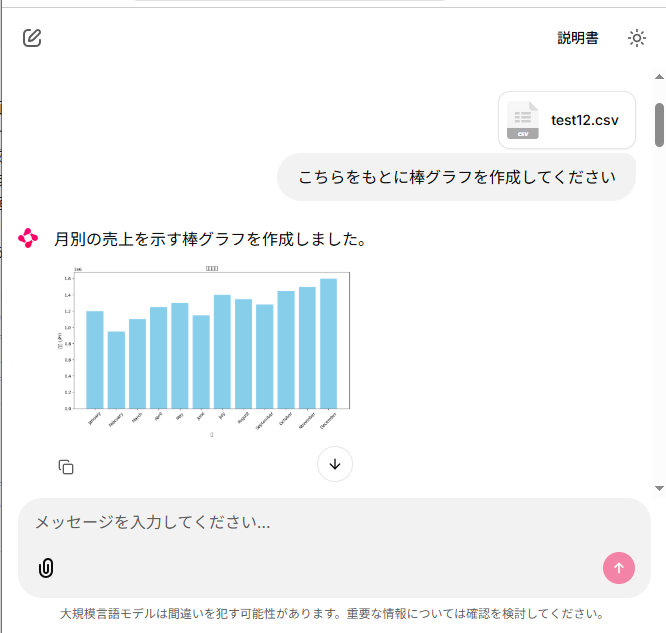
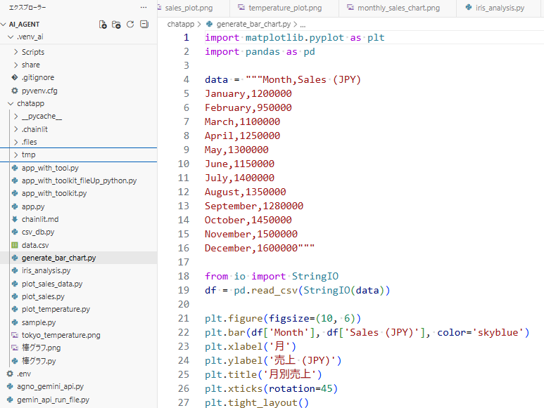

## Agnoのツールキットを使用する

Agnoのツールキットは「Agnoが用意した便利なツールのセット」
**外部API（Google Search, YouTube, Slackなど）を使った様々なものがある**

[ツールキットの紹介](https://docs.agno.com/cookbook/tools/built-in)

### Webツールを使ってみる(DuckDuckGo Search)
APIキー不要の　Web検索ツール　DuckDuckGo Searchを使用したAIエージェントです

[使用例](https://docs.agno.com/tools/toolkits/search/duckduckgo)

python ライブラリ追加
``` bash
pip install ddgs
```

AIエージェントのtoolにDuckDuckGo Search追加
``` python
import chainlit as cl
from agno.agent import Agent
from agno.models.google import Gemini
from agno.media import Image
from dotenv import load_dotenv
from agno.db.in_memory import InMemoryDb
from agno.agent import RunEvent
from csv_db import register_to_csv, search_in_csv
from agno.tools.duckduckgo import DuckDuckGoTools # 追加

load_dotenv()


@cl.on_chat_start
async def on_chat_start():

	agent = Agent(
		model=Gemini(id="gemini-2.0-flash"),
		description="あなたは、さまざまな分野で人々を支援する有能なAIエージェントです。",
		instructions=[
			"内容をよく理解し、正確かつ丁寧に回答してください。",
			"ツールの呼び出しは、ユーザーの入力内容に応じて適切なタイミングで行ってください。",
		],
		db=InMemoryDb(),
		add_history_to_context=True,
		tools=[register_to_csv, search_in_csv, DuckDuckGoTools()],　# 追加
	)

	cl.user_session.set("agent", agent)
  
  

@cl.on_message

async def on_message(message: cl.Message):
# 以降の処理は変更ないため割愛

```

実行例


### ツールキットの連続技(検索した内容をpdfに出力)

Web検索ツールDuckDuckGo Searchで検索した内容を
File GenerationツールでPDFに出力します

python ライブラリ追加
``` bash
pip install reportlab
```

AIエージェントソースへの追記内容のみ記載
``` python
from agno.tools.file_generation import FileGenerationTools
```

``` python
tools=[
			register_to_csv,
			search_in_csv,
			DuckDuckGoTools(),
			FileGenerationTools(output_directory="tmp"),# 出力先(相対パス)を引数に指定
		],
```

実行例

出力内容



### Python ツールキットの使用

[参考サイト](https://docs.agno.com/tools/toolkits/local/python)

AIエージェントがPythonコードの作成及び実行できるようにします。
[「自作ツールをエージェントに使用させる」]()では自分でPythonの関数を用意していましたが
Python ツールキットによって、用意していないような処理もその場で作成して実行してくれるようになります。
例としてcsvファイルを読み込んでグラフを作成できるAIエージェントを作成します


グラフを作成させるために、python ライブラリ追加
Python ツールキットが作成するPython コード内で使用される見込み
こちらのライブラリを使用してくれるかはAI次第または、プロンプト次第なところはあります。
``` bash
pip install pandas matplotlib
```

#### AIエージェントソース
``` python
import chainlit as cl
from agno.agent import Agent
from agno.models.google import Gemini
from agno.media import Image
from agno.media import File
from dotenv import load_dotenv
from agno.db.in_memory import InMemoryDb
from agno.agent import RunEvent
from agno.tools.duckduckgo import DuckDuckGoTools
from agno.tools.file_generation import FileGenerationTools
from agno.tools.python import PythonTools

load_dotenv()


@cl.on_chat_start
async def on_chat_start():

	agent = Agent(
		model=Gemini(id="gemini-2.5-flash"),
		description="あなたは、さまざまな分野で人々を支援する有能なAIエージェントです。",
		instructions=[
			"""
			- グラフ生成時は、画像ファイル（PNG形式）として保存し、そのファイルパス（例: `tmp/plot.png`）のみを戻り値として返すPythonコードを生成・実行してください。
			- `tool.result`には画像パスのみが含まれるようにしてください。
			""",
		],
		db=InMemoryDb(),
		add_history_to_context=True,
		tools=[
			DuckDuckGoTools(),
			FileGenerationTools(output_directory="tmp"),
			PythonTools(),
		],
	)

	cl.user_session.set("agent", agent)


@cl.on_message
async def on_message(message: cl.Message):
	content_started = False
	images = [
		Image(filepath=file.path) for file in message.elements if "image" in file.mime
	]

	# Geminiの無料で使えるLLMだとファイルはcsvファイルのみ対応(中身は英語じゃないとダメか？)
	files = [
		File(filepath=element.path, mime_type=element.mime)
		for element in message.elements
		if not "image" in element.mime and hasattr(element, "path")
	]

	agent = cl.user_session.get("agent")

	msg = cl.Message(content="")
	async for chunk in agent.arun(
		message.content,  # ユーザーからの入力メッセージ（テキスト）
		images=images,  # 添付された画像（Imageオブジェクトのリスト）
		stream=True,  # モデルの応答をチャンク（分割）で受け取るかどうか（Trueならストリーミング）
		stream_events=True,  # ツール呼び出しなどのイベントもチャンクとして受け取るかどうか
		files=files,  # 添付されたファイル（Fileオブジェクトのリスト）
	):
		if chunk.event in [RunEvent.run_started, RunEvent.run_completed]:
			print(f"\nEVENT: {chunk.event}")

		if chunk.event in [RunEvent.tool_call_started]:
			print(f"\nEVENT: {chunk.event}")
			print(f"TOOL CALL: {chunk.tool.tool_name}")
			print(f"TOOL CALL ARGS: {chunk.tool.tool_args}")

		if chunk.event in [RunEvent.tool_call_completed]:
			print(f"TOOL CALL RESULT: {chunk.tool.result}")
			# 画像パス
			image_path = None
			# 例: resultが画像パスの場合
			if isinstance(chunk.tool.result, str) and chunk.tool.result.endswith(
				".png"
			):
				image_path = chunk.tool.result
			# 例: resultが辞書の場合
			elif isinstance(chunk.tool.result, dict) and "path" in chunk.tool.result:
				image_path = chunk.tool.result["path"]
			if image_path:
				# 画像をメッセージに追加
				msg.elements.append(
					cl.Image(path=image_path, name="image1", display="inline")
				)

		if chunk.event in [RunEvent.run_content]:

			if not content_started:
				print("\nCONTENT:")
				content_started = True
			else:
				print(chunk.content, end="")
			# 文字列コンテンツをメッセージにストリーム
			await msg.stream_token(getattr(chunk, "content", str(chunk)))

		await msg.send()

```

うまくいくとこのようになる


作成されたコードはローカルに保存されるが、保存先や実行後に破棄するかの設定も可能
内容を見ると、csvファイルのデータがべた書きされているので、ファイルを読み取る処理をつけるように
指示をすると改善されるかもしれない。

