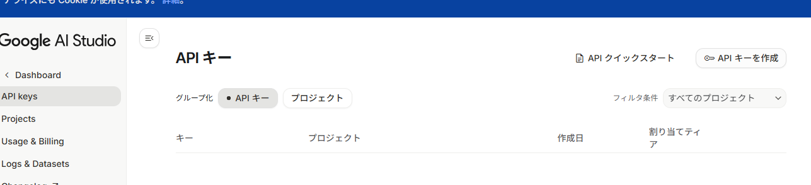
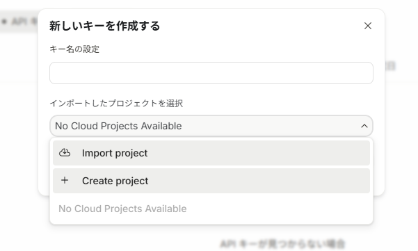
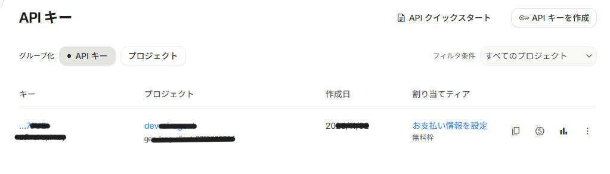
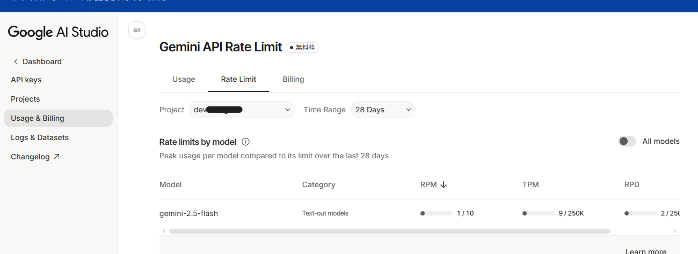

1. 以下サイトにGoogleアカウントでサインインします。 
[AI Studio](https://aistudio.google.com/app/apikey?hl=ja&_gl=1*4uk6ra*_ga*MjAxMzM2NzIyNi4xNzYyMDg4NDIy*_ga_P1DBVKWT6V*czE3NjIwODg0MjIkbzEkZzEkdDE3NjIwODg1NDEkajMwJGwwJGgyMDI1MTI5NDg4)

2. APIキーを作成ボタンを押下します。

3. 「新しいキーを作成する」のウィンドウでプロジェクトを作成（名前を決めるくらい）

4. 作成したプロジェクトを選択してキー名を設定（任意の名前）

5. 一覧に作成したキーが表示されます。キー名のリンクからキーを表示できます。無料枠となっていることも要確認

6. 利用状況の確認内容
    - 1 分あたりのリクエスト数（**RPM**）
    - 1 分あたりのトークン数（入力）（**TPM**）
    - 1 日あたりのリクエスト数（**RPD**）
     
    **※多分どれか一つが制限を越えたら　エラー**
